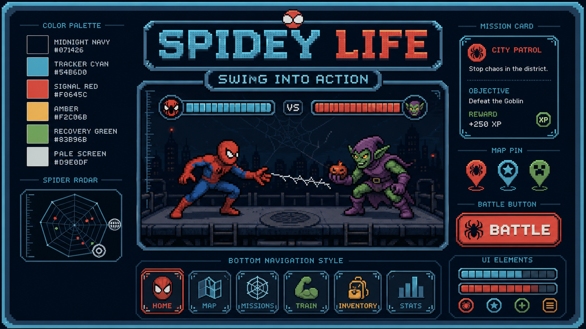

# SPIDEY LIFE — Design System & Brand Identity Guidelines

> **Tên phong cách thiết kế**: **Retro Cyber-Pixel Comic Console**  
> **Triết lý**: "Biến kỷ luật đời thực thành năng lượng chiến đấu. Mỗi pixel đều mang trọng lượng."

---

## 1. Bản Sắc Thương Hiệu (Brand Persona & Philosophy)
- **Tính cách**: Dứt khoát, kỷ luật, hưng phấn, đậm chất siêu anh hùng đường phố (Friendly Neighborhood).
- **Cảm giác mang lại**: Người dùng cảm giác như đang cầm một thiết bị điều khiển phần cứng của Peter Parker (Spidey Mission Computer), nơi mỗi việc đời thực hoàn thành là một cú tung tơ giáng đòn hạ gục kẻ ác.
- **Giọng văn (Voice & Tone)**: Ngắn gọn, in hoa dứt khoát, mang âm hưởng máy móc radar kết hợp truyện tranh:
  - *`MISSION COMPLETE // +35 XP`*
  - *`THWIP! WEB SHOT HIT!`*
  - *`FINISHER READY // EXECUTE NOW`*

---

## 2. Hệ Thống Màu & Design Tokens (Color Palette)

| Tên Token | Mã HEX | Vai Trò Ngữ Nghĩa | Ứng Dụng Trong Giao Diện |
| :--- | :---: | :--- | :--- |
| **Midnight Navy** | `#071426` | Nền tảng vũ trụ tối sâu | Khung viền ngoài, body canvas chính |
| **Console Navy** | `#102C45` | Nền khối kim loại | Thẻ bài (card), bảng điều khiển, drawer |
| **Tracker Cyan** | `#00F0FF` | Năng lượng công nghệ / XP | Tơ nhện điện tử, thanh cấp độ XP, GPS |
| **Spider Red** | `#F0645C` | Đòn đánh / Máu Boss | Thanh HP kẻ thù, nút tấn công chủ lực, cảnh báo |
| **Web Amber** | `#F2C06B` | Vàng kim / Stagger | Điểm yếu quái, tiền xu Web Coins, thanh Stagger |
| **Mission Green** | `#83B96B` | Thành công / Kỷ luật | Nhiệm vụ đã xong (DONE), chuỗi Streak |
| **Notion Indigo** | `#7C4DFF` | Liên kết đám mây Notion | Thẻ nhiệm vụ đồng bộ từ Notion Zeus |
| **Ink Black** | `#050B12` | Viền đen đanh thép | Viền pixel 4px, bóng đổ khối bậc thang |
| **Paper White** | `#F1F5F9` | Văn bản hiển thị | Text tiêu đề, thông số đọc rõ trên nền tối |

---

## 3. Hệ Thống Typography (Font Chữ)

Hệ thống kết hợp bộ 3 font chữ có vai trò chuyên biệt:

1. **`Press Start 2P`** *(8-Bit Retro Game Font)*:
   - Sử dụng cho: Logo game, Level nhân vật, chữ VS đấu boss, thông báo K.O. và Finisher.
2. **`Silkscreen`** *(LCD / Console Font)*:
   - Sử dụng cho: Thanh điều hướng 5 mode, nhãn nút bấm, chỉ số HP/Web/Stagger.
3. **`Be Vietnam Pro`** *(Modern Clean Sans-Serif)*:
   - Sử dụng cho: Tiêu đề nhiệm vụ tiếng Việt, nội dung mô tả thói quen Notion, nhật ký combat log (đảm bảo dấu tiếng Việt hiển thị mượt mà, không bị răng cưa khó đọc).

---

## 4. Quy Chuẩn Linh Kiện Giao Diện (UI Components)

### A. Nút Bấm Pixel (Pixel Tactile Buttons)
- **Đặc trưng**: Viền đen dày `3-4px`, viền trong sáng màu, bóng đổ lệch góc `0 4px 0 #000000`.
- **Hiệu ứng Click**: Khi bấm chuột hoặc chạm tay (`:active`), nút thụt xuống `transform: translateY(3px)` và bóng biến mất, mô phỏng phím cơ máy bấm game boy.

### B. Thước Đo Chỉ Số (Combat & Life Meters)
- **Thanh HP**: Viền đen pixel, vạch đỏ cam tụt giật cấp theo đòn đánh.
- **Thanh Stagger**: Vạch vàng kim nạp dần từ 0% -> 100%. Khi chạm 100%, chuyển sang nhấp nháy phát sáng báo hiệu mở khóa `FINISHER`.
- **Thanh Web Energy**: Vạch Cyan điện tử nạp khi thực hiện thói quen tốt.

### C. Hiệu Ứng Truyện Tranh (Comic Popups)
- Khi hoàn thành nhiệm vụ: Chữ Comic SFX (`THWIP!`, `POW!`, `KRAK!`) nảy lên với góc nghiêng `-8deg` và phóng to trong 400ms.
- Sát thương đòn kết liễu: Rung màn hình `Screen Shake` 200ms.

---

## 5. Quy Tắc Cấm Kỵ Trong Thiết Kế (Anti-Patterns)
1. ❌ **Không dùng Glassmorphism**: Không dùng thẻ mờ trong suốt `backdrop-filter: blur()`. Tất cả phải là bề mặt bảng kim loại mờ hoặc viền cứng.
2. ❌ **Không bo tròn góc quá mềm**: Bán kính bo góc tối đa là `2px` hoặc `0px` (chuẩn pixel), không bo tròn `border-radius: 20px` kiểu iOS/macOS.
3. ❌ **Không dùng Lootbox / Rương quay số**: Giao diện chỉ hiển thị phần thưởng thực tế tương xứng với nhiệm vụ đã làm.
