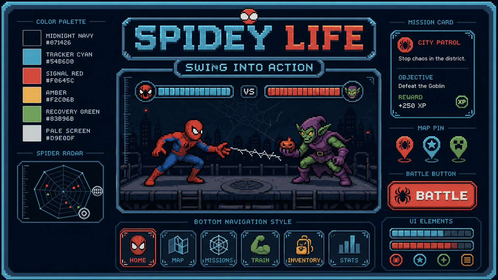

# SPIDEY LIFE — Brand & Interface Guide

## Product idea

SPIDEY LIFE turns completed real-life missions into attacks against an active villain raid. The home screen is the Arena. Map, Missions, Allies, and Profile are separate functional modes—not decoration.

## Visual DNA

- Primary influence: the compact pixel hardware frame, scanlines, labels, and map-console language of Spidey Tracker.
- Layout rhythm: a central battle stage, account status above, one decisive action below, and five modes at the bottom.
- Pixel UI must feel like a handheld mission computer: hard black outlines, inset borders, stepped shadows, no soft glass cards.
- Avoid copied game chest/shop systems, glossy 3D rewards, lootbox prompts, and controls that do nothing.

## Palette

| Token | Hex | Use |
|---|---:|---|
| Midnight Navy | `#071426` | main shell, deepest background |
| Console Navy | `#102C45` | panels and stage |
| Tracker Cyan | `#54B6D0` | active navigation, XP, map hardware |
| Spider Red | `#F0645C` | battle action, threat, villain HP |
| Web Amber | `#F2C06B` | important labels, weakness, highlights |
| Mission Green | `#83B96B` | streaks, success, allies |
| Paper White | `#D9E0DF` | controls and readable foreground |
| Ink Black | `#050B12` | outlines and stepped shadows |

## Type

- `Press Start 2P`: big actions, VS, level readout, boss result.
- `Silkscreen`: navigation, labels, meters, compact system copy.
- `Be Vietnam Pro`: longer Vietnamese descriptions, forms, logs.

## Components

- Buttons use 2–4 px black outlines, colored inset strokes, and a 3–6 px hard shadow.
- Every visible control must open a mode, panel, editor, drawer, or execute a real game action.
- Icons use one-color pixel/line silhouettes: spider mask, crossed web tools, mission card, map fold, spider emblem.
- Arena action copy uses comic feedback such as `THWIP!`, `POW!`, `K.O.!`, and `WEB FINISHER` sparingly.
- Map is navigation-only. A click on the map never creates a mission.

## Screen hierarchy

1. Account progress: level, XP, Web Coins, streak.
2. Active villain contract and weakness.
3. Hero-versus-villain Arena.
4. Boss health and latest combat feedback.
5. One battle action linked to real-life missions.
6. Functional modes: Missions, Allies, Arena, Map, Profile.

## Generated project assets

- `app-v6/assets/brand/spidey-life-brand-board-v1.png`: project-bound design reference.
- `app-v6/assets/brand/goblin-rival-pixel-v1.png`: original transparent pixel villain used in the Arena.

These assets are original project art generated for SPIDEY LIFE. Keep future assets aligned with the board's palette, chunky silhouettes, crisp nearest-neighbor pixel edges, and dark console framing.
